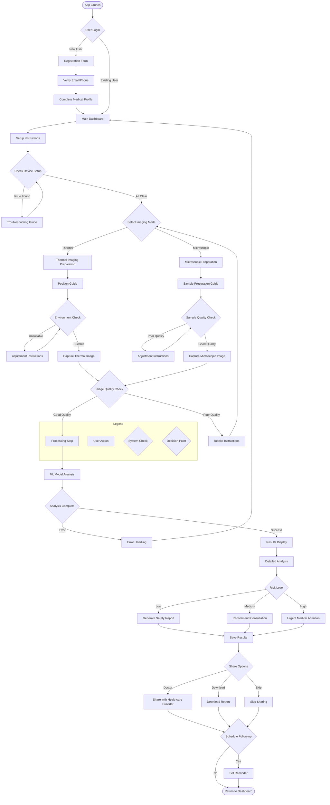

# Mobile Thermal MediScan

A smartphone-based breast cancer screening system utilizing thermal imaging and microscopic analysis.

## System Workflow

## Project Description
A mobile application designed to provide accessible, cost-effective breast cancer screening using smartphone attachments for thermal imaging and microscopic analysis.

### Key Features
- Thermal imaging for surface heat variation detection
- Microscopic analysis of tissue samples
- AI-based detection model
- User-friendly guided imaging process
- Secure data handling and sharing

### Hardware Requirements
- Smartphone (iOS/Android)
- Thermal imaging attachment
- Microscope attachment
- Mounting system

### Software Components
- Mobile application (iOS/Android)
- Backend processing server
- Machine learning analysis system
- Image processing pipeline
- Secure data storage

## Getting Started
[Instructions for setting up and running the project will be added]

## Contributing
[Contribution guidelines will be added]

## License
[License information will be added]

## Contact
[Contact information will be added]
