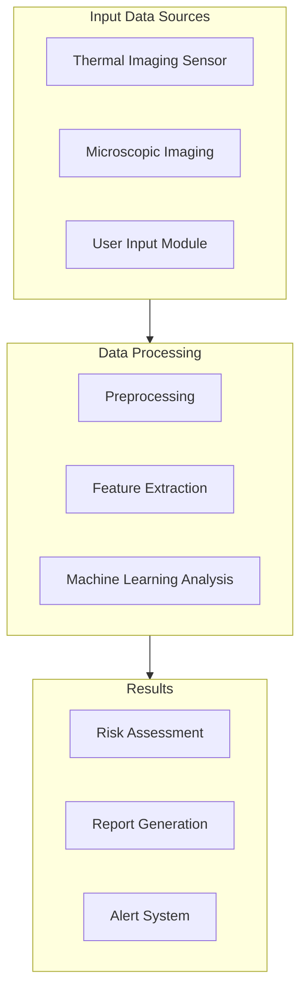

# Mobile Thermal MediScan

A smartphone-based breast cancer screening system that combines thermal imaging, microscopic analysis, and AI-powered diagnostics for accessible and early detection.


## 📱 Project Overview

Mobile Thermal MediScan is an innovative medical screening solution that transforms smartphones into powerful diagnostic tools. By combining thermal imaging, microscopic analysis, and machine learning, we aim to make breast cancer screening more accessible and affordable, especially in underserved regions.

### 🎯 Key Features

- Dual-mode imaging (thermal + microscopic)
- Real-time analysis and results
- Historical data comparison
- AI-powered risk assessment
- Secure data handling
- User-friendly interface
- Telemedicine integration

## 🔧 Hardware Components

| Component | Description | Price Range | Purpose |
|-----------|-------------|-------------|----------|
| FLIR Lepton / Seek Thermal CompactPro | Thermal camera attachments | $200 - $500 | Heat map capture for anomaly detection |
| iMicro Q2 / Jiusion USB Digital Microscope | Digital microscope | $30 - $60 | High-magnification tissue analysis |
| Smartphone (iOS/Android) | High-end device | Varies | Image capture and processing |
| Phone Mount/Stand | Stabilization system | $10 - $30 | Image stability |
| LED Ring Light | Illumination system | $15 - $30 | Consistent lighting |
| Calibration Tools | Reference tools | $20 - $40 | Measurement standardization |
| Backup Battery | Power source | $30 - $50 | Extended operation |
| Protective Case | Storage solution | $40 - $80 | Equipment protection |
| Sanitization Kit | Cleaning supplies | $20 - $30 | Hygiene maintenance |
| Cloud/Server Infrastructure | Processing backend | Varies | Data processing & ML operations |

## 💻 Technical Architecture



## 🚀 Getting Started

### Prerequisites
- Compatible smartphone (iOS 14+ / Android 9+)
- Required hardware components
- Internet connection for cloud features
- Development environment setup

### Installation
```bash
# Clone the repository
git clone https://github.com/yourusername/mobile-thermal-mediscan.git

# Install dependencies
npm install   # For mobile app
pip install -r requirements.txt   # For ML backend

# Configure environment
cp .env.example .env
```

## 📊 System Workflow

1. **Data Collection**
   - Thermal imaging capture
   - Microscopic sample analysis
   - User symptom input

2. **Processing**
   - Image preprocessing
   - Feature extraction
   - ML model inference

3. **Analysis**
   - Risk assessment
   - Historical comparison
   - Result generation

## 🔬 Technical Details

### Mobile Application
- React Native / Flutter
- Native camera integration
- Real-time processing capabilities

### Backend System
- Python-based ML pipeline
- TensorFlow/PyTorch models
- REST API architecture

### Data Security
- HIPAA compliance measures
- End-to-end encryption
- Secure data storage

## 📄 Documentation

Detailed documentation is available in the `/docs` directory:
- [Setup Guide](docs/setup.md)
- [User Manual](docs/manual.md)
- [API Documentation](docs/api.md)
- [Contributing Guidelines](docs/contributing.md)

## 🤝 Contributing

We welcome contributions! Please read our [Contributing Guidelines](CONTRIBUTING.md) before submitting pull requests.

## 📝 License

This project is licensed under the MIT License - see the [LICENSE.md](LICENSE.md) file for details.

## 🔗 Related Research

- [Thermal Imaging in Medical Diagnosis](link-to-paper)
- [Mobile Microscopy Advances](link-to-paper)
- [AI in Cancer Detection](link-to-paper)

## ✉️ Contact

- **Project Lead:** [Your Name](mailto:your.email@example.com)
- **Website:** [Project Website](https://your-project-website.com)
- **Issues:** [GitHub Issues](https://github.com/yourusername/mobile-thermal-mediscan/issues)

## 🙏 Acknowledgments

- Medical advisors and collaborators
- Research institutions
- Open source community

---
*Note: This project is for research and development purposes. It is not a certified medical device and should not be used for actual medical diagnosis without proper validation and certification.*
