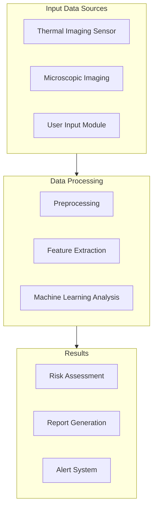

# Mobile Thermal MediScan

A smartphone-based breast cancer screening system that combines thermal imaging, microscopic analysis, and AI-powered diagnostics for accessible and early detection.

## 📱 Project Overview

Mobile Thermal MediScan is an innovative medical screening solution that transforms smartphones into powerful diagnostic tools. By combining thermal imaging, microscopic analysis, and machine learning, we aim to make breast cancer screening more accessible and affordable, especially in underserved regions.

### 🎯 Key Features

- Dual-mode imaging (thermal + microscopic)
- Real-time analysis and results
- Historical data comparison
- AI-powered risk assessment
- Secure data handling
- User-friendly interface
- Telemedicine integration

## 🔧 Hardware Components

| Component | Description | Price Range | Purpose |
|-----------|-------------|-------------|----------|
| FLIR Lepton / Seek Thermal CompactPro | Thermal camera attachments | $200 - $500 | Heat map capture for anomaly detection |
| iMicro Q2 / Jiusion USB Digital Microscope | Digital microscope | $30 - $60 | High-magnification tissue analysis |
| Smartphone (iOS/Android) | High-end device | Varies | Image capture and processing |
| Phone Mount/Stand | Stabilization system | $10 - $30 | Image stability |
| LED Ring Light | Illumination system | $15 - $30 | Consistent lighting |
| Calibration Tools | Reference tools | $20 - $40 | Measurement standardization |
| Backup Battery | Power source | $30 - $50 | Extended operation |
| Protective Case | Storage solution | $40 - $80 | Equipment protection |
| Sanitization Kit | Cleaning supplies | $20 - $30 | Hygiene maintenance |
| Cloud/Server Infrastructure | Processing backend | Varies | Data processing & ML operations |

## 💻 Technical Architecture

## 🚀 Getting Started

### Prerequisites
- Compatible smartphone (iOS 14+ / Android 9+)
- Required hardware components
- Internet connection for cloud features
- Development environment setup

